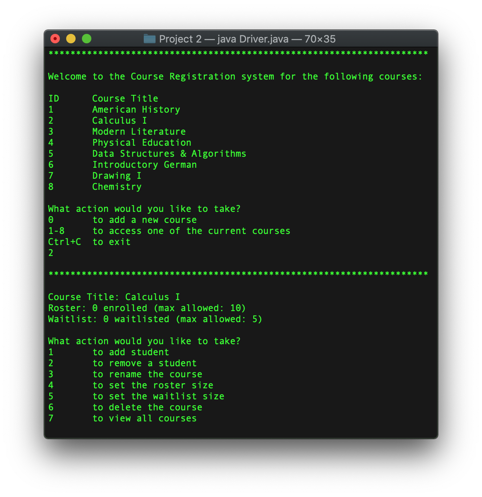
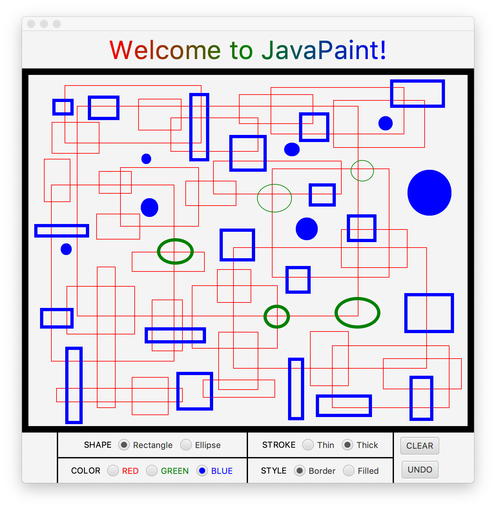

# CS 111B - Programming Fundamentals: Java

A 7-week accelerated course in Java

## Content
1. Java Basics - Data, Variables, Strings, Methods, Loops, Conditionals
2. Classes and Objects
3. Arrays & ArrayLists
4. Java Standard Library
5. Inheritance
6. Polymorphism
7. GUIs with JavaFX
8. Exception Handling

## Projects

1. Course Registration System

  

2. JavaPaint

  
